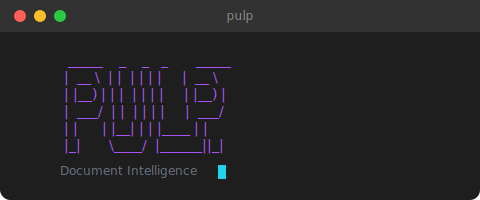

<p align="center">
  
</p>

<h1 align="center">Pulp</h1>

<p align="center">
  <strong>Document Intelligence for the Terminal</strong>
</p>

<p align="center">
  <a href="#installation">Installation</a> |
  <a href="#quick-start">Quick Start</a> |
  <a href="#features">Features</a> |
  <a href="#providers">Providers</a> |
  <a href="#skills">Skills</a>
</p>

<p align="center">
  
  
  
</p>

---

## What is Pulp?

Pulp is a terminal-based document intelligence tool that combines LLM-powered conversations with document processing. Drop a PDF, ask questions, extract insights, or just chat - all from your terminal.

```
 ____  _   _ _     ____
|  _ \| | | | |   |  _ \
| |_) | | | | |   | |_) |
|  __/| |_| | |___|  __/
|_|    \___/|_____|_|

> Analyze this contract for potential risks
```

---

## Features

<table>
<tr>
<td width="50%">

### Multi-Provider LLM Support

Connect to any major LLM provider or run locally with Ollama:

- **OpenAI** - GPT-4o, GPT-4 Turbo
- **Anthropic** - Claude 3.5 Sonnet, Claude 3 Opus
- **Groq** - Ultra-fast Llama 3, Mixtral
- **Ollama** - Local models, no API key needed
- **OpenRouter** - Access to 100+ models
- **Custom** - Any OpenAI-compatible endpoint

</td>
<td width="50%">

### Document Processing

Convert and analyze documents using Docling:

- **PDF** - Full text extraction with layout preservation
- **Word** - DOCX, DOC support
- **Web** - HTML, HTM pages
- **Text** - Markdown, plain text, RTF, ODT

</td>
</tr>
<tr>
<td width="50%">

### Real-Time Streaming

Watch responses generate in real-time with live stats:

```
o Thinking...  42 tok/s  1.2k/128k ctx  3.2s
```

- Token generation speed
- Context window usage
- Elapsed time tracking
- Animated loading states

</td>
<td width="50%">

### Skills System

Create specialized AI assistants for specific tasks:

```bash
> /summarizer    # Summarize documents
> /code-review   # Review code changes
> /translator    # Translate content
> /new-skill     # Create your own with AI
```

</td>
</tr>
</table>

---

## Installation

### Prerequisites

| Requirement | Version | Notes |
|-------------|---------|-------|
| Go | 1.22+ | [Download](https://go.dev/dl/) |
| Python | 3.8+ | For document conversion |
| Docling | Latest | `pip install docling` |

### Build from Source

```bash
# Clone the repository
git clone https://github.com/sant0-9/pulp.git
cd pulp

# Build
go build -o pulp ./cmd/pulp

# Run
./pulp
```

### Install Docling

```bash
pip install docling
```

---

## Quick Start

### 1. First Run Setup

On first run, Pulp will prompt you to configure your LLM provider:

```
Provider: openai
API Key:  sk-...
Model:    gpt-4o
```

### 2. Start Chatting

Just type to chat:

```
> What are the main themes in 1984 by George Orwell?
```

### 3. Process Documents

Drop a file path to analyze documents:

```
> ~/Documents/report.pdf
```

### 4. Use Skills

Activate specialized skills:

```
> /summarizer Summarize this quarterly earnings report
```

---

## Providers

### Configuration

Config file: `~/.config/pulp/config.yaml`

<details>
<summary><b>OpenAI</b></summary>

```yaml
provider: openai
api_key: sk-your-api-key-here
model: gpt-4o
```

Models: `gpt-4o`, `gpt-4-turbo`, `gpt-4`, `gpt-3.5-turbo`

</details>

<details>
<summary><b>Anthropic</b></summary>

```yaml
provider: anthropic
api_key: sk-ant-your-api-key-here
model: claude-3-5-sonnet-20241022
```

Models: `claude-3-5-sonnet-20241022`, `claude-3-opus-20240229`, `claude-3-sonnet-20240229`, `claude-3-haiku-20240307`

</details>

<details>
<summary><b>Groq</b></summary>

```yaml
provider: groq
api_key: gsk_your-api-key-here
model: llama-3.1-70b-versatile
```

Models: `llama-3.1-70b-versatile`, `llama-3.1-8b-instant`, `mixtral-8x7b-32768`

</details>

<details>
<summary><b>Ollama (Local)</b></summary>

```yaml
provider: ollama
model: llama3.1:8b
base_url: http://localhost:11434  # optional
```

Any model available in your Ollama installation.

</details>

<details>
<summary><b>OpenRouter</b></summary>

```yaml
provider: openrouter
api_key: sk-or-your-api-key-here
model: anthropic/claude-3.5-sonnet
```

Access to 100+ models from various providers.

</details>

<details>
<summary><b>Custom Endpoint</b></summary>

```yaml
provider: custom
api_key: your-api-key
model: your-model
base_url: https://your-endpoint.com/v1
```

Any OpenAI-compatible API.

</details>

---

## Commands

| Command | Description |
|:--------|:------------|
| `/help` | Show help menu |
| `/settings` | Configure provider and model |
| `/skills` | List available skills |
| `/new-skill <description>` | Generate a new skill with AI |
| `/<skill-name> [message]` | Use a specific skill |
| `/quit` | Exit Pulp |

---

## Keyboard Shortcuts

| Key | Context | Action |
|:----|:--------|:-------|
| `Enter` | Input | Submit message |
| `Esc` | Any | Go back / Cancel streaming |
| `s` | Welcome | Open settings |
| `?` | Welcome | Show help |
| `Ctrl+U` | Chat | Scroll up |
| `Ctrl+D` | Chat | Scroll down |
| `PgUp/PgDown` | Chat | Scroll page |

---

## Skills

Skills are Markdown files with YAML frontmatter that define specialized AI behaviors.

### Location

```
~/.config/pulp/skills/
```

### Format

```markdown
---
name: code-reviewer
description: Review code for bugs, style, and best practices
---

You are an expert code reviewer. When reviewing code:

1. Check for bugs and logic errors
2. Evaluate code style and readability
3. Suggest performance improvements
4. Identify security vulnerabilities

Provide specific, actionable feedback with code examples.
```

### Creating Skills

**Option 1:** Create manually in `~/.config/pulp/skills/your-skill/SKILL.md`

**Option 2:** Generate with AI:

```
> /new-skill Create a skill for writing SQL queries from natural language
```

---

## Architecture

```
pulp/
├── cmd/pulp/           # Entry point
├── internal/
│   ├── config/         # Configuration management
│   ├── converter/      # Docling bridge for document conversion
│   ├── intent/         # User intent detection
│   ├── llm/            # LLM provider implementations
│   │   ├── anthropic.go
│   │   ├── openai.go
│   │   ├── groq.go
│   │   ├── ollama.go
│   │   └── openrouter.go
│   ├── pipeline/       # Document processing pipeline
│   ├── prompts/        # System prompts
│   ├── skill/          # Skill loading and management
│   ├── tui/            # Terminal UI (Bubble Tea)
│   └── writer/         # Output formatting
├── python/             # Docling bridge script
└── assets/             # Screenshots and media
```

---

## Contributing

Contributions are welcome! Please feel free to submit a Pull Request.

1. Fork the repository
2. Create your feature branch (`git checkout -b feature/amazing-feature`)
3. Commit your changes (`git commit -m 'Add amazing feature'`)
4. Push to the branch (`git push origin feature/amazing-feature`)
5. Open a Pull Request

---

## License

This project is licensed under the MIT License - see the [LICENSE](LICENSE) file for details.

---

<p align="center">
  Built with <a href="https://github.com/charmbracelet/bubbletea">Bubble Tea</a> and <a href="https://github.com/charmbracelet/lipgloss">Lipgloss</a>
</p>
